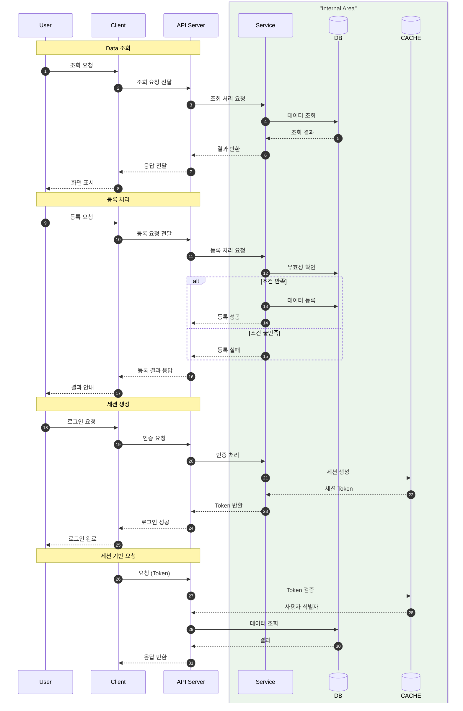
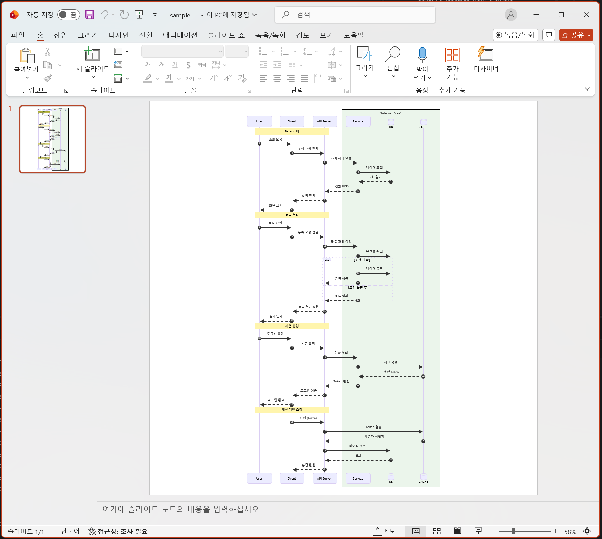

# mermaid to pptx

A project that converts Mermaid diagrams into PowerPoint (.pptx) shapes by rendering Mermaid to SVG and then analyzing
and reconstructing the diagram using native PowerPoint objects.

This project focuses on vector-based conversion, not image embedding, so the resulting slides remain fully editable and
scalable.

---

## Features

- Accepts Mermaid diagram syntax as input
- Renders Mermaid diagrams to SVG
- Parses SVG structure (shapes, lines, text)
- Converts elements into PowerPoint (.pptx) shapes
- Produces fully editable, vector-based slides

---

## Sample Output





---

## Overall Flow

```text
Mermaid Code
     ↓
Mermaid Renderer (SVG)
     ↓
SVG Parsing
     ↓
Shape & Text Extraction
     ↓
PowerPoint (.pptx)
